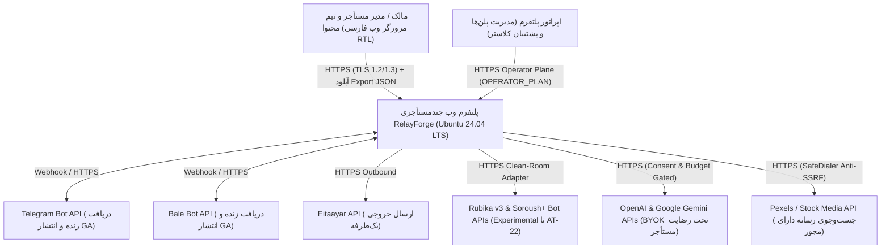

# 01 — نمودار زمینه سیستم (C4 System Context — Web SaaS Edition)

```mermaid
flowchart TD
    Owner["مالک / مدیر مستأجر و تیم محتوا (مرورگر وب فارسی RTL)"]
    Ops["اپراتور پلتفرم (مدیریت پلن‌ها و پشتیبان کلاستر)"]
    RF["پلتفرم وب چندمستأجری RelayForge (Ubuntu 24.04 LTS)"]
    TG["Telegram Bot API (دریافت زنده و انتشار GA)"]
    Bale["Bale Bot API (دریافت زنده و انتشار GA)"]
    Eitaa["Eitaayar API (ارسال خروجی یک‌طرفه)"]
    ExpMsg["Rubika v3 & Soroush+ Bot APIs (Experimental تا AT-22)"]
    AI["OpenAI & Google Gemini APIs (BYOK تحت رضایت مستأجر)"]
    Stock["Pexels / Stock Media API (جست‌وجوی رسانه دارای مجوز)"]

    Owner -->|"HTTPS (TLS 1.2/1.3) + آپلود Export JSON"| RF
    Ops -->|"HTTPS Operator Plane (OPERATOR_PLAN)"| RF
    RF <-->|"Webhook / HTTPS"| TG
    RF <-->|"Webhook / HTTPS"| Bale
    RF -->|"HTTPS Outbound"| Eitaa
    RF -->|"HTTPS Clean-Room Adapter"| ExpMsg
    RF -->|"HTTPS (Consent & Budget Gated)"| AI
    RF -->|"HTTPS (SafeDialer Anti-SSRF)"| Stock
```
