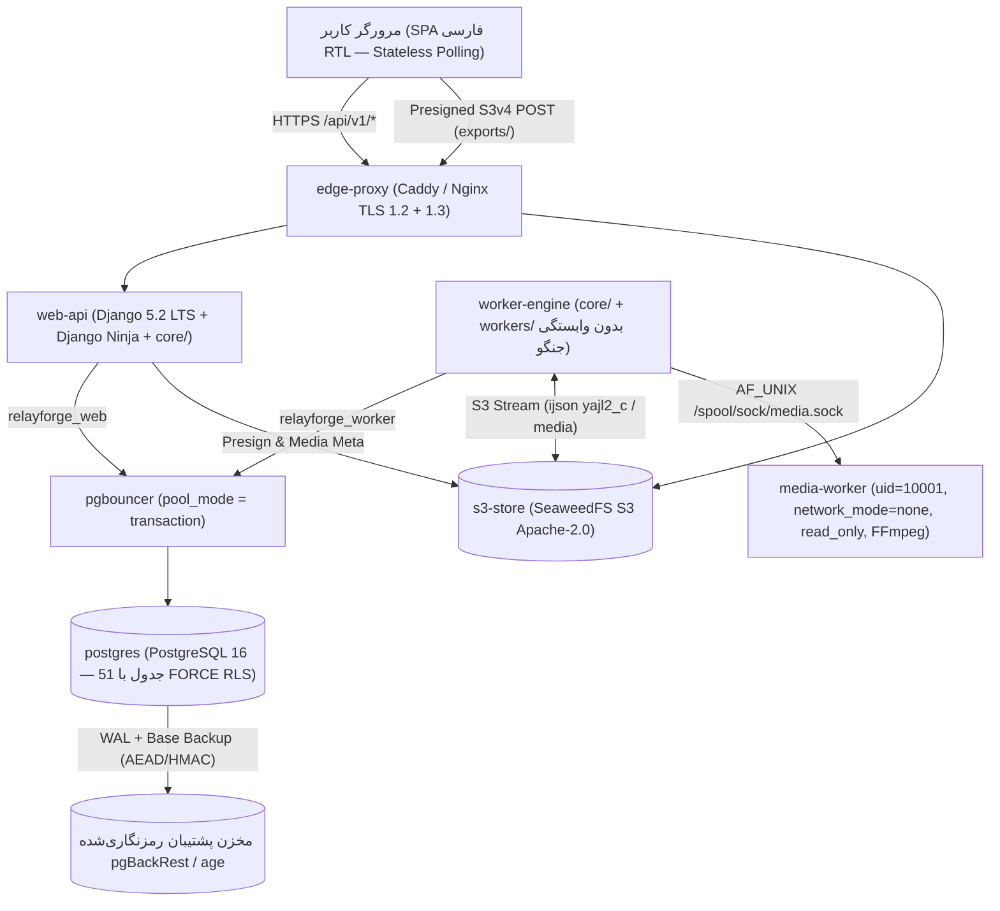

# 02 — نمودار کانتینرهای معماری (C4 Container Diagram — Ubuntu 24.04 Compose)

```mermaid
flowchart TD
    Browser["مرورگر کاربر (SPA فارسی RTL — Stateless Polling)"]
    Proxy["edge-proxy (Caddy / Nginx TLS 1.2 + 1.3)"]
    Web["web-api (Django 5.2 LTS + Django Ninja + core/)"]
    Worker["worker-engine (core/ + workers/ بدون وابستگی جنگو)"]
    Media["media-worker (uid=10001, network_mode=none, read_only, FFmpeg)"]
    PGB["pgbouncer (pool_mode = transaction)"]
    PG[("postgres (PostgreSQL 16 — 51 جدول با FORCE RLS)")]
    S3[("s3-store (SeaweedFS S3 Apache-2.0)")]
    PITR[("مخزن پشتیبان رمزنگاری‌شده pgBackRest / age")]

    Browser -->|"HTTPS /api/v1/*"| Proxy
    Browser -->|"Presigned S3v4 POST (exports/)"| Proxy
    Proxy --> Web
    Proxy --> S3
    Web -->|"relayforge_web"| PGB
    Worker -->|"relayforge_worker"| PGB
    PGB --> PG
    Worker <-->|"S3 Stream (ijson yajl2_c / media)"| S3
    Web -->|"Presign & Media Meta"| S3
    Worker -->|"AF_UNIX /spool/sock/media.sock"| Media
    PG -->|"WAL + Base Backup (AEAD/HMAC)"| PITR
```
