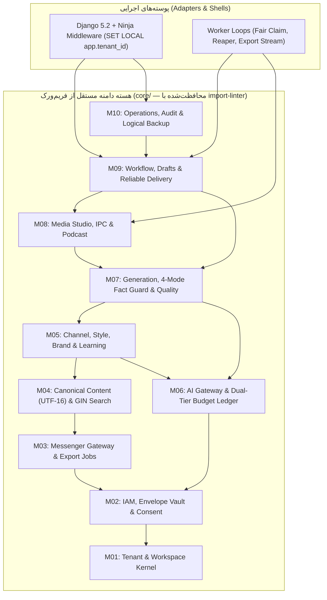

# 03 — نمودار مؤلفه‌ها و گراف وابستگی ماژول‌های هسته (`M01`..`M10`)

```mermaid
flowchart TD
    subgraph Shell["پوسته‌های اجرایی (Adapters & Shells)"]
        WebAPI["Django 5.2 + Ninja Middleware (SET LOCAL app.tenant_id)"]
        Workers["Worker Loops (Fair Claim, Reaper, Export Stream)"]
    end

    subgraph Core["هسته دامنه مستقل از فریم‌ورک (core/ — محافظت‌شده با import-linter)"]
        M01["M01: Tenant & Workspace Kernel"]
        M02["M02: IAM, Envelope Vault & Consent"]
        M03["M03: Messenger Gateway & Export Jobs"]
        M04["M04: Canonical Content (UTF-16) & GIN Search"]
        M05["M05: Channel, Style, Brand & Learning"]
        M06["M06: AI Gateway & Dual-Tier Budget Ledger"]
        M07["M07: Generation, 4-Mode Fact Guard & Quality"]
        M08["M08: Media Studio, IPC & Podcast"]
        M09["M09: Workflow, Drafts & Reliable Delivery"]
        M10["M10: Operations, Audit & Logical Backup"]
    end

    WebAPI --> M09
    WebAPI --> M10
    Workers --> M09
    Workers --> M08
    M10 --> M09
    M09 --> M08
    M09 --> M07
    M08 --> M07
    M07 --> M05
    M07 --> M06
    M05 --> M04
    M05 --> M06
    M04 --> M03
    M03 --> M02
    M06 --> M02
    M02 --> M01
```
