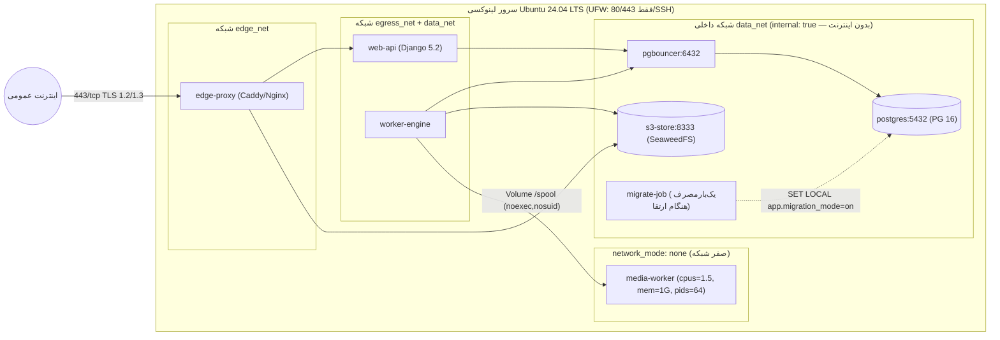

# 04 — نمودار استقرار شبکه و جداسازی کانتینرها روی `Ubuntu 24.04 LTS`

```mermaid
flowchart LR
    Internet(("اینترنت عمومی"))
    subgraph Host["سرور لینوکسی Ubuntu 24.04 LTS (UFW: فقط 80/443/SSH)"]
        subgraph EdgeNet["شبکه edge_net"]
            Caddy["edge-proxy (Caddy/Nginx)"]
        end
        subgraph AppNet["شبکه egress_net + data_net"]
            Web["web-api (Django 5.2)"]
            Wrk["worker-engine"]
        end
        subgraph DataNet["شبکه داخلی data_net (internal: true — بدون اینترنت)"]
            PGB["pgbouncer:6432"]
            PG[("postgres:5432 (PG 16)")]
            S3[("s3-store:8333 (SeaweedFS)")]
            Mig["migrate-job (یک‌بارمصرف هنگام ارتقا)"]
        end
        subgraph AirGap["network_mode: none (صفر شبکه)"]
            MW["media-worker (cpus=1.5, mem=1G, pids=64)"]
        end
    end

    Internet -->|"443/tcp TLS 1.2/1.3"| Caddy
    Caddy --> Web
    Caddy --> S3
    Web --> PGB
    Wrk --> PGB
    PGB --> PG
    Mig -.->|"SET LOCAL app.migration_mode=on"| PG
    Wrk --> S3
    Wrk -->|"Volume /spool (noexec,nosuid)"| MW
```
