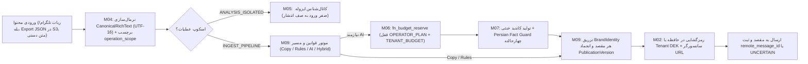

# 05 — نمودار جریان داده، ایزولاسیون مستأجر و جداسازی اسرار

```mermaid
flowchart LR
    Src["ورودی محتوا (ربات تلگرام/بله، Export JSON در S3، متن دستی)"]
    Ingest["M04: نرمال‌سازی CanonicalRichText (UTF-16) + برچسب operation_scope"]
    Scope{"اسکوپ عملیات؟"}
    Analysis["M05: کانال‌شناس ایزوله (صفر ورود به صف انتشار)"]
    Pipeline["M09: موتور قوانین و مسیر (Copy / Rules / AI / Hybrid)"]
    Budget["M06: fn_budget_reserve (قفل OPERATOR_PLAN + TENANT_BUDGET)"]
    Gen["M07: تولید کاندید خنثی + Persian Fact Guard چهارحالته"]
    Freeze["M09: تزریق BrandIdentity هر مقصد و انجماد PublicationVersion"]
    Vault["M02: رمزگشایی در حافظه با Tenant DEK + سانسورگر URL"]
    Dest["ارسال به مقصد و ثبت remote_message_id یا UNCERTAIN"]

    Src --> Ingest --> Scope
    Scope -->|"ANALYSIS_ISOLATED"| Analysis
    Scope -->|"INGEST_PIPELINE"| Pipeline
    Pipeline -->|"نیازمند AI"| Budget --> Gen --> Freeze
    Pipeline -->|"Copy / Rules"| Freeze
    Freeze --> Vault --> Dest
```
