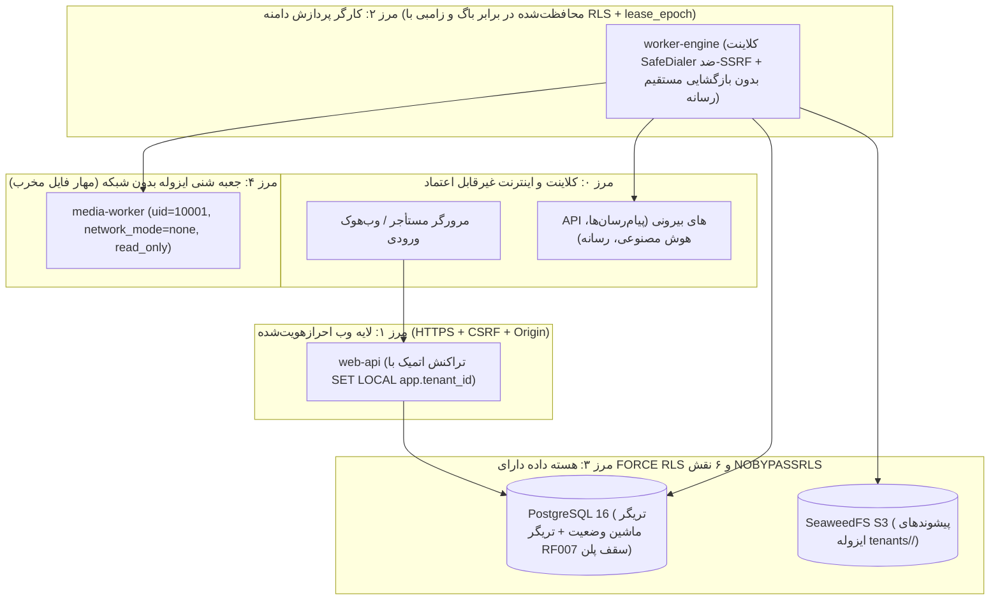

# 06 — نمودار مرزهای اعتماد امنیتی (Security Trust Boundaries)

```mermaid
flowchart TD
    subgraph TB0["مرز ۰: کلاینت و اینترنت غیرقابل اعتماد"]
        Client["مرورگر مستأجر / وب‌هوک ورودی"]
        ExtAPI["APIهای بیرونی (پیام‌رسان‌ها، هوش مصنوعی، رسانه)"]
    end

    subgraph TB1["مرز ۱: لایه وب احرازهویت‌شده (HTTPS + CSRF + Origin)"]
        Web["web-api (تراکنش اتمیک با SET LOCAL app.tenant_id)"]
    end

    subgraph TB2["مرز ۲: کارگر پردازش دامنه (محافظت‌شده در برابر باگ و زامبی با RLS + lease_epoch)"]
        Wrk["worker-engine (کلاینت SafeDialer ضد-SSRF + بدون بازگشایی مستقیم رسانه)"]
    end

    subgraph TB3["مرز ۳: هسته داده دارای FORCE RLS و ۶ نقش NOBYPASSRLS"]
        DB[("PostgreSQL 16 (تریگر ماشین وضعیت + تریگر RF007 سقف پلن)")]
        Obj[("SeaweedFS S3 (پیشوندهای ایزوله tenants/<tid>/)")]
    end

    subgraph TB4["مرز ۴: جعبه شنی ایزوله بدون شبکه (مهار فایل مخرب)"]
        Media["media-worker (uid=10001, network_mode=none, read_only)"]
    end

    Client --> Web
    Web --> DB
    Wrk --> DB
    Wrk --> Obj
    Wrk --> Media
    Wrk --> ExtAPI
```
