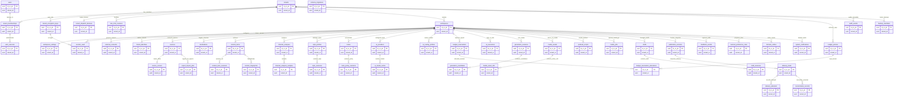

# 07 — نمودار کامل موجودیت-رابطه ۵۱ جدول دیتابیس PostgreSQL 16 (`app.*`)

```mermaid
erDiagram
    tenants ||--o{ tenant_memberships : "has_members"
    users ||--o{ tenant_memberships : "belongs_to"
    tenant_memberships ||--o{ web_sessions : "authenticates"
    tenants ||--o{ tenant_encryption_keys : "owns_dek"
    tenants ||--o| tenant_dispatch_fairness : "tracks_fairness"
    tenants ||--o{ rate_limit_counters : "throttles"
    tenants ||--o{ workspaces : "isolates"
    workspaces ||--|| workspace_settings : "configures"
    workspaces ||--o{ secrets_vault : "stores_secrets"
    tenant_encryption_keys ||--o{ secrets_vault : "encrypts"
    workspaces ||--o{ external_consents : "governs_consent"
    workspaces ||--o{ brand_identities : "defines_brands"
    workspaces ||--o{ sources : "connects_sources"
    sources ||--o| source_cursors : "tracks_offset"
    sources ||--o{ export_import_jobs : "ingests_s3_exports"
    workspaces ||--o{ destinations : "targets_channels"
    workspaces ||--o{ content_items : "archives"
    content_items ||--o{ content_item_revisions : "versions_ast"
    workspaces ||--o{ channel_analyses : "analyzes"
    channel_analyses ||--o{ channel_analysis_samples : "samples"
    workspaces ||--o{ style_profiles : "catalogs_styles"
    style_profiles ||--o{ style_revisions : "versions_style"
    workspaces ||--o{ routes : "orchestrates"
    routes ||--o{ route_policy_revisions : "versions_policy"
    content_items ||--o{ content_fingerprints : "deduplicates"
    workspaces ||--o{ ai_providers : "configures_byok"
    ai_providers ||--o{ ai_model_cache : "caches_models"
    workspaces ||--o{ ai_routing_profiles : "routes_models"
    tenants ||--o{ budget_policies : "enforces_caps"
    workspaces ||--o{ budget_reservations : "reserves_spend"
    budget_reservations ||--o{ budget_reservation_allocations : "allocates_buckets"
    budget_policies ||--o{ budget_reservation_allocations : "caps_bucket"
    workspaces ||--o{ ai_executions : "logs_ai_calls"
    workspaces ||--o{ generation_sessions : "runs_studio"
    generation_sessions ||--o{ generation_candidates : "produces_candidates"
    workspaces ||--o{ media_assets : "stores_s3_media"
    media_assets ||--o{ media_asset_refs : "protects_active_refs"
    workspaces ||--o{ podcast_scripts : "scripts_podcast"
    workspaces ||--o{ media_jobs : "queues_media_ipc"
    workspaces ||--o{ drafts : "manages_drafts"
    drafts ||--o{ draft_revisions : "versions_draft"
    workspaces ||--o{ publication_versions : "freezes_snapshot"
    publication_versions ||--o{ delivery_tasks : "enqueues_delivery"
    delivery_tasks ||--o{ delivery_attempts : "records_attempts"
    delivery_tasks ||--o{ reconciliation_records : "reconciles_uncertain"
    workspaces ||--o{ feedback_events : "captures_edits"
    workspaces ||--o{ learned_preference_rules : "proposes_rules"
    workspaces ||--o{ domain_outbox : "emits_events"
    tenants ||--o{ audit_events : "audits_immutably"
    workspaces ||--o{ system_notifications : "dedups_alerts"
    tenants ||--o{ backup_manifests : "tracks_backups"

    tenants {
        uuid id_or_pk PK
        uuid tenant_id
    }
    users {
        uuid id_or_pk PK
        uuid tenant_id
    }
    tenant_memberships {
        uuid id_or_pk PK
        uuid tenant_id
    }
    web_sessions {
        uuid id_or_pk PK
        uuid tenant_id
    }
    tenant_encryption_keys {
        uuid id_or_pk PK
        uuid tenant_id
    }
    tenant_dispatch_fairness {
        uuid id_or_pk PK
        uuid tenant_id
    }
    schema_migrations {
        uuid id_or_pk PK
        uuid tenant_id
    }
    rate_limit_counters {
        uuid id_or_pk PK
        uuid tenant_id
    }
    workspaces {
        uuid id_or_pk PK
        uuid tenant_id
    }
    workspace_settings {
        uuid id_or_pk PK
        uuid tenant_id
    }
    secrets_vault {
        uuid id_or_pk PK
        uuid tenant_id
    }
    external_consents {
        uuid id_or_pk PK
        uuid tenant_id
    }
    brand_identities {
        uuid id_or_pk PK
        uuid tenant_id
    }
    sources {
        uuid id_or_pk PK
        uuid tenant_id
    }
    source_cursors {
        uuid id_or_pk PK
        uuid tenant_id
    }
    export_import_jobs {
        uuid id_or_pk PK
        uuid tenant_id
    }
    destinations {
        uuid id_or_pk PK
        uuid tenant_id
    }
    content_items {
        uuid id_or_pk PK
        uuid tenant_id
    }
    content_item_revisions {
        uuid id_or_pk PK
        uuid tenant_id
    }
    channel_analyses {
        uuid id_or_pk PK
        uuid tenant_id
    }
    channel_analysis_samples {
        uuid id_or_pk PK
        uuid tenant_id
    }
    style_profiles {
        uuid id_or_pk PK
        uuid tenant_id
    }
    style_revisions {
        uuid id_or_pk PK
        uuid tenant_id
    }
    routes {
        uuid id_or_pk PK
        uuid tenant_id
    }
    route_policy_revisions {
        uuid id_or_pk PK
        uuid tenant_id
    }
    content_fingerprints {
        uuid id_or_pk PK
        uuid tenant_id
    }
    ai_providers {
        uuid id_or_pk PK
        uuid tenant_id
    }
    ai_model_cache {
        uuid id_or_pk PK
        uuid tenant_id
    }
    ai_routing_profiles {
        uuid id_or_pk PK
        uuid tenant_id
    }
    budget_policies {
        uuid id_or_pk PK
        uuid tenant_id
    }
    budget_reservations {
        uuid id_or_pk PK
        uuid tenant_id
    }
    budget_reservation_allocations {
        uuid id_or_pk PK
        uuid tenant_id
    }
    ai_executions {
        uuid id_or_pk PK
        uuid tenant_id
    }
    generation_sessions {
        uuid id_or_pk PK
        uuid tenant_id
    }
    generation_candidates {
        uuid id_or_pk PK
        uuid tenant_id
    }
    media_assets {
        uuid id_or_pk PK
        uuid tenant_id
    }
    media_asset_refs {
        uuid id_or_pk PK
        uuid tenant_id
    }
    podcast_scripts {
        uuid id_or_pk PK
        uuid tenant_id
    }
    media_jobs {
        uuid id_or_pk PK
        uuid tenant_id
    }
    drafts {
        uuid id_or_pk PK
        uuid tenant_id
    }
    draft_revisions {
        uuid id_or_pk PK
        uuid tenant_id
    }
    publication_versions {
        uuid id_or_pk PK
        uuid tenant_id
    }
    delivery_tasks {
        uuid id_or_pk PK
        uuid tenant_id
    }
    delivery_attempts {
        uuid id_or_pk PK
        uuid tenant_id
    }
    reconciliation_records {
        uuid id_or_pk PK
        uuid tenant_id
    }
    feedback_events {
        uuid id_or_pk PK
        uuid tenant_id
    }
    learned_preference_rules {
        uuid id_or_pk PK
        uuid tenant_id
    }
    domain_outbox {
        uuid id_or_pk PK
        uuid tenant_id
    }
    audit_events {
        uuid id_or_pk PK
        uuid tenant_id
    }
    system_notifications {
        uuid id_or_pk PK
        uuid tenant_id
    }
    backup_manifests {
        uuid id_or_pk PK
        uuid tenant_id
    }
```
