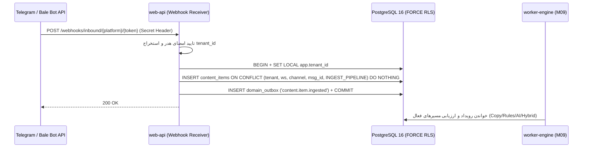

# 08 — نمودار توالی دریافت زنده پیام با Bot API و تشخیص تکرار

```mermaid
sequenceDiagram
    participant BotAPI as Telegram / Bale Bot API
    participant Web as web-api (Webhook Receiver)
    participant DB as PostgreSQL 16 (FORCE RLS)
    participant Wrk as worker-engine (M09)

    BotAPI->>Web: POST /webhooks/inbound/{platform}/{token} (Secret Header)
    Web->>Web: تایید امضای هدر و استخراج tenant_id
    Web->>DB: BEGIN + SET LOCAL app.tenant_id
    Web->>DB: INSERT content_items ON CONFLICT (tenant, ws, channel, msg_id, INGEST_PIPELINE) DO NOTHING
    Web->>DB: INSERT domain_outbox ('content.item.ingested') + COMMIT
    Web-->>BotAPI: 200 OK
    Wrk->>DB: خواندن رویداد و ارزیابی مسیرهای فعال (Copy/Rules/AI/Hybrid)
```
