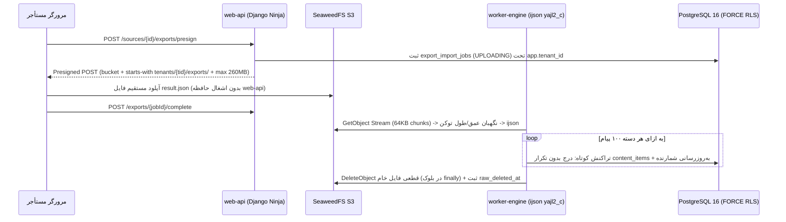

# 09 — نمودار توالی آپلود Presigned آرشیو تلگرام به S3 و پارس جریانی `ijson`

```mermaid
sequenceDiagram
    participant UI as مرورگر مستأجر
    participant Web as web-api (Django Ninja)
    participant S3 as SeaweedFS S3
    participant Wrk as worker-engine (ijson yajl2_c)
    participant DB as PostgreSQL 16 (FORCE RLS)

    UI->>Web: POST /sources/{id}/exports/presign
    Web->>DB: ثبت export_import_jobs (UPLOADING) تحت app.tenant_id
    Web-->>UI: Presigned POST (bucket + starts-with tenants/{tid}/exports/ + max 260MB)
    UI->>S3: آپلود مستقیم فایل result.json (بدون اشغال حافظه web-api)
    UI->>Web: POST /exports/{jobId}/complete
    Wrk->>S3: GetObject Stream (64KB chunks) -> نگهبان عمق/طول توکن -> ijson
    loop به ازای هر دسته ۱۰۰ پیام
        Wrk->>DB: تراکنش کوتاه: درج بدون تکرار content_items + به‌روزرسانی شمارنده
    end
    Wrk->>S3: DeleteObject قطعی فایل خام (در بلوک finally) + ثبت raw_deleted_at
```
