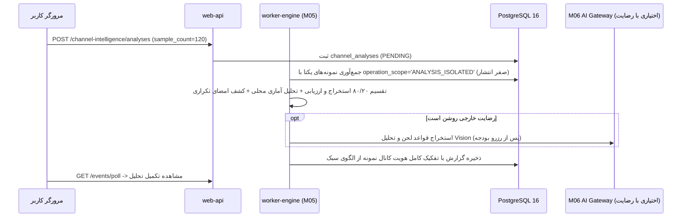

# 10 — نمودار توالی کانال‌شناس هوشمند با جداسازی اسکوپ و هویت

```mermaid
sequenceDiagram
    participant UI as مرورگر کاربر
    participant Web as web-api
    participant Wrk as worker-engine (M05)
    participant DB as PostgreSQL 16
    participant AI as M06 AI Gateway (اختیاری با رضایت)

    UI->>Web: POST /channel-intelligence/analyses (sample_count=120)
    Web->>DB: ثبت channel_analyses (PENDING)
    Wrk->>DB: جمع‌آوری نمونه‌های یکتا با operation_scope='ANALYSIS_ISOLATED' (صفر انتشار)
    Wrk->>Wrk: تقسیم ۸۰/۲۰ استخراج و ارزیابی + تحلیل آماری محلی + کشف امضای تکراری
    opt رضایت خارجی روشن است
        Wrk->>AI: استخراج قواعد لحن و تحلیل Vision (پس از رزرو بودجه)
    end
    Wrk->>DB: ذخیره گزارش با تفکیک کامل هویت کانال نمونه از الگوی سبک
    UI->>Web: GET /events/poll -> مشاهده تکمیل تحلیل
```
