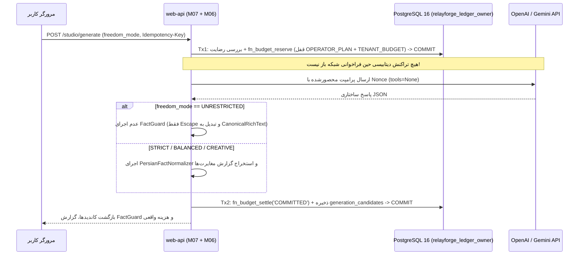

# 11 — نمودار توالی تولید محتوا در استودیو و قرارداد چهار حالت آزادی

```mermaid
sequenceDiagram
    participant UI as مرورگر کاربر
    participant Web as web-api (M07 + M06)
    participant DB as PostgreSQL 16 (relayforge_ledger_owner)
    participant LLM as OpenAI / Gemini API

    UI->>Web: POST /studio/generate (freedom_mode, Idempotency-Key)
    Web->>DB: Tx1: بررسی رضایت + fn_budget_reserve (قفل OPERATOR_PLAN + TENANT_BUDGET) -> COMMIT
    Note over Web,LLM: هیچ تراکنش دیتابیسی حین فراخوانی شبکه باز نیست!
    Web->>LLM: ارسال پرامپت محصورشده با Nonce (tools=None)
    LLM-->>Web: پاسخ ساختاری JSON
    alt freedom_mode == UNRESTRICTED
        Web->>Web: عدم اجرای FactGuard (فقط Escape و تبدیل به CanonicalRichText)
    else STRICT / BALANCED / CREATIVE
        Web->>Web: اجرای PersianFactNormalizer و استخراج گزارش مغایرت‌ها
    end
    Web->>DB: Tx2: fn_budget_settle('COMMITTED') + ذخیره generation_candidates -> COMMIT
    Web-->>UI: بازگشت کاندیدها، گزارش FactGuard و هزینه واقعی
```
