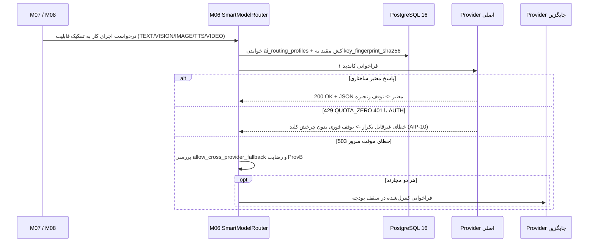

# 12 — نمودار توالی مسیریابی مدل، کش کلیدمحور و مدیریت خطاهای سهمیه

```mermaid
sequenceDiagram
    participant Caller as M07 / M08
    participant Router as M06 SmartModelRouter
    participant DB as PostgreSQL 16
    participant ProvA as Provider اصلی
    participant ProvB as Provider جایگزین

    Caller->>Router: درخواست اجرای کار به تفکیک قابلیت (TEXT/VISION/IMAGE/TTS/VIDEO)
    Router->>DB: خواندن ai_routing_profiles + کش مقید به key_fingerprint_sha256
    Router->>ProvA: فراخوانی کاندید ۱
    alt پاسخ معتبر ساختاری
        ProvA-->>Router: 200 OK + JSON معتبر -> توقف زنجیره
    else 429 QUOTA_ZERO یا 401 AUTH
        ProvA-->>Router: خطای غیرقابل تکرار -> توقف فوری بدون چرخش کلید (AIP-10)
    else 503 خطای موقت سرور
        Router->>Router: بررسی allow_cross_provider_fallback و رضایت ProvB
        opt هر دو مجازند
            Router->>ProvB: فراخوانی کنترل‌شده در سقف بودجه
        end
    end
```
