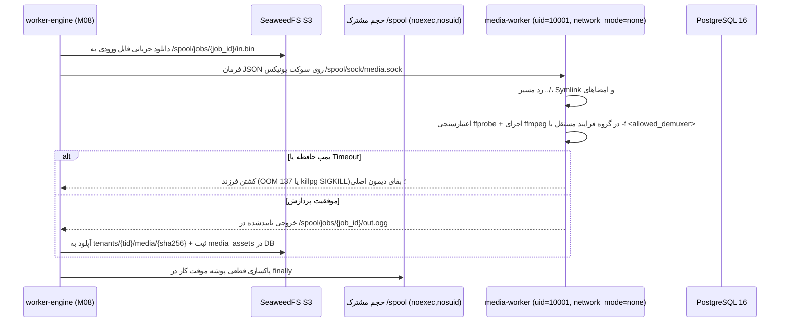

# 13 — نمودار توالی پردازش رسانه در کانتینر بدون شبکه `media-worker`

```mermaid
sequenceDiagram
    participant Wrk as worker-engine (M08)
    participant S3 as SeaweedFS S3
    participant Spool as حجم مشترک /spool (noexec,nosuid)
    participant MW as media-worker (uid=10001, network_mode=none)
    participant DB as PostgreSQL 16

    Wrk->>S3: دانلود جریانی فایل ورودی به /spool/jobs/{job_id}/in.bin
    Wrk->>MW: فرمان JSON روی سوکت یونیکس /spool/sock/media.sock
    MW->>MW: رد مسیر ../، Symlink و امضاهای #EXTM3U / ffconcat
    MW->>MW: اعتبارسنجی ffprobe + اجرای ffmpeg در گروه فرایند مستقل با -f <allowed_demuxer>
    alt بمب حافظه یا Timeout
        MW-->>Wrk: کشتن فرزند (OOM 137 یا killpg SIGKILL)؛ بقای دیمون اصلی
    else موفقیت پردازش
        MW-->>Wrk: خروجی تاییدشده در /spool/jobs/{job_id}/out.ogg
        Wrk->>S3: آپلود به tenants/{tid}/media/{sha256} + ثبت media_assets در DB
    end
    Wrk->>Spool: پاکسازی قطعی پوشه موقت کار در finally
```
