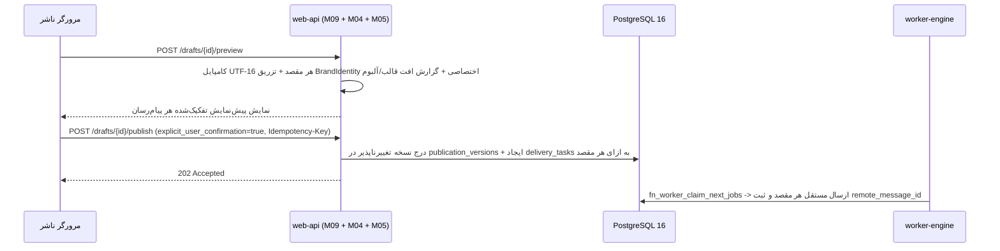

# 14 — نمودار توالی پیش‌نمایش مقصد، انجماد نسخه انتشار و ارسال دستی

```mermaid
sequenceDiagram
    participant UI as مرورگر ناشر
    participant Web as web-api (M09 + M04 + M05)
    participant DB as PostgreSQL 16
    participant Wrk as worker-engine

    UI->>Web: POST /drafts/{id}/preview
    Web->>Web: کامپایل UTF-16 هر مقصد + تزریق BrandIdentity اختصاصی + گزارش افت قالب/آلبوم
    Web-->>UI: نمایش پیش‌نمایش تفکیک‌شده هر پیام‌رسان
    UI->>Web: POST /drafts/{id}/publish (explicit_user_confirmation=true, Idempotency-Key)
    Web->>DB: درج نسخه تغییرناپذیر در publication_versions + ایجاد delivery_tasks به ازای هر مقصد
    Web-->>UI: 202 Accepted
    Wrk->>DB: fn_worker_claim_next_jobs -> ارسال مستقل هر مقصد و ثبت remote_message_id
```
