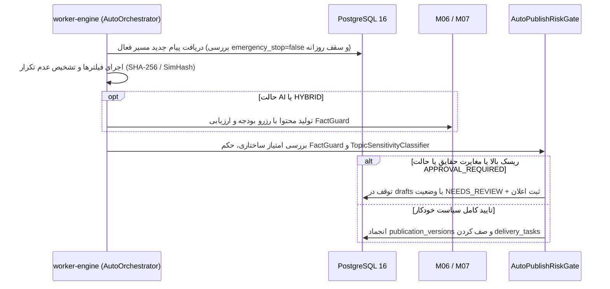

# 15 — نمودار توالی انتشار خودکار هوشمند و دروازه ریسک (`M09`)

```mermaid
sequenceDiagram
    participant Wrk as worker-engine (AutoOrchestrator)
    participant DB as PostgreSQL 16
    participant AI as M06 / M07
    participant Gate as AutoPublishRiskGate

    Wrk->>DB: دریافت پیام جدید مسیر فعال (بررسی emergency_stop=false و سقف روزانه)
    Wrk->>Wrk: اجرای فیلترها و تشخیص عدم تکرار (SHA-256 / SimHash)
    opt حالت AI یا HYBRID
        Wrk->>AI: تولید محتوا با رزرو بودجه و ارزیابی FactGuard
    end
    Wrk->>Gate: بررسی امتیاز ساختاری، حکم FactGuard و TopicSensitivityClassifier
    alt ریسک بالا یا مغایرت حقایق یا حالت APPROVAL_REQUIRED
        Gate->>DB: توقف در drafts با وضعیت NEEDS_REVIEW + ثبت اعلان
    else تایید کامل سیاست خودکار
        Gate->>DB: انجماد publication_versions و صف کردن delivery_tasks
    end
```
