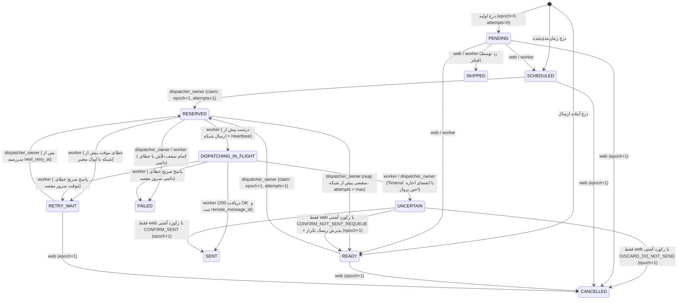

# 16 — نمودار ماشین وضعیت تحویل و حصارکشی `lease_epoch` (اجبارشده در Trigger)

```mermaid
stateDiagram-v2
    [*] --> PENDING : درج اولیه (epoch=0, attempts=0)
    [*] --> SCHEDULED : درج زمان‌بندی‌شده
    [*] --> READY : درج آماده ارسال

    PENDING --> SCHEDULED : web / worker
    PENDING --> READY : web / worker
    PENDING --> SKIPPED : web / worker (رد توسط فیلتر)

    SCHEDULED --> RESERVED : dispatcher_owner (claim: epoch+1, attempts+1)
    READY --> RESERVED : dispatcher_owner (claim: epoch+1, attempts+1)
    RETRY_WAIT --> RESERVED : dispatcher_owner (پس از سررسید next_retry_at)

    RESERVED --> READY : dispatcher_owner (reap منقضی پیش از شبکه، attempts < max)
    RESERVED --> FAILED : dispatcher_owner / worker (اتمام سقف تلاش یا خطای دائمی)
    RESERVED --> RETRY_WAIT : worker (خطای موقت پیش از شبکه با اپوک معتبر)
    RESERVED --> DISPATCHING_IN_FLIGHT : worker (درست پیش از ارسال شبکه + Heartbeat)

    DISPATCHING_IN_FLIGHT --> SENT : worker (دریافت 200 OK و ثبت remote_message_id)
    DISPATCHING_IN_FLIGHT --> RETRY_WAIT : worker (پاسخ صریح خطای موقت سرور مقصد)
    DISPATCHING_IN_FLIGHT --> FAILED : worker (پاسخ صریح خطای دائمی سرور مقصد)
    DISPATCHING_IN_FLIGHT --> UNCERTAIN : worker / dispatcher_owner (Timeout یا انقضای اجاره حین پرواز!)

    UNCERTAIN --> SENT : فقط web با رکورد آشتی CONFIRM_SENT (epoch+1)
    UNCERTAIN --> READY : فقط web با رکورد آشتی CONFIRM_NOT_SENT_REQUEUE + پذیرش ریسک تکرار (epoch+1)
    UNCERTAIN --> CANCELLED : فقط web با رکورد آشتی DISCARD_DO_NOT_SEND (epoch+1)

    PENDING --> CANCELLED : web (epoch+1)
    SCHEDULED --> CANCELLED : web (epoch+1)
    READY --> CANCELLED : web (epoch+1)
    RETRY_WAIT --> CANCELLED : web (epoch+1)
```
