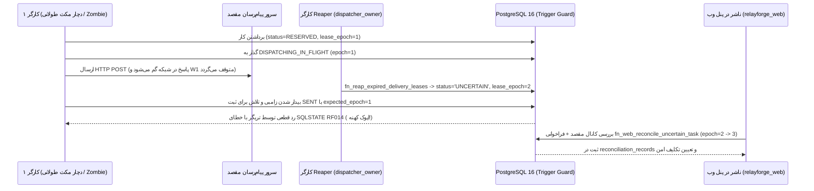

# 17 — نمودار توالی مهار کارگر زامبی (`Fencing`) و چرخه آشتی `UNCERTAIN`

```mermaid
sequenceDiagram
    participant W1 as کارگر ۱ (دچار مکث طولانی / Zombie)
    participant Dest as سرور پیام‌رسان مقصد
    participant Reaper as کارگر Reaper (dispatcher_owner)
    participant DB as PostgreSQL 16 (Trigger Guard)
    participant Web as ناشر در پنل وب (relayforge_web)

    W1->>DB: برداشتن کار (status=RESERVED, lease_epoch=1)
    W1->>DB: گذار به DISPATCHING_IN_FLIGHT (epoch=1)
    W1->>Dest: ارسال HTTP POST (پاسخ در شبکه گم می‌شود و W1 متوقف می‌گردد)
    Reaper->>DB: fn_reap_expired_delivery_leases -> status='UNCERTAIN', lease_epoch=2
    W1->>DB: بیدار شدن زامبی و تلاش برای ثبت SENT با expected_epoch=1
    DB-->>W1: رد قطعی توسط تریگر با خطای SQLSTATE RF014 ( اپوک کهنه!)
    Web->>DB: بررسی کانال مقصد + فراخوانی fn_web_reconcile_uncertain_task (epoch=2 -> 3)
    DB-->>Web: ثبت در reconciliation_records و تعیین تکلیف امن
```
