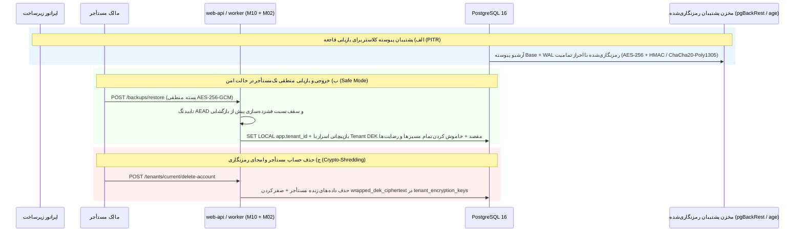

# 18 — نمودار توالی پشتیبان دوگانه (`PITR` کلاستر، بازیابی امن مستأجر و `Crypto-Shredding`)

```mermaid
sequenceDiagram
    participant Ops as اپراتور زیرساخت
    participant Owner as مالک مستأجر
    participant Web as web-api / worker (M10 + M02)
    participant DB as PostgreSQL 16
    participant Repo as مخزن پشتیبان رمزنگاری‌شده (pgBackRest / age)

    rect rgb(235, 245, 255)
        Note over Ops,Repo: الف) پشتیبان پیوسته کلاستر برای بازیابی فاجعه (PITR)
        DB->>Repo: آرشیو پیوسته Base + WAL رمزنگاری‌شده با احراز تمامیت (AES-256 + HMAC / ChaCha20-Poly1305)
    end
    rect rgb(240, 255, 240)
        Note over Owner,DB: ب) خروجی و بازیابی منطقی تک‌مستأجر در حالت امن (Safe Mode)
        Owner->>Web: POST /backups/restore (بسته منطقی AES-256-GCM)
        Web->>Web: تایید تگ AEAD و سقف نسبت فشرده‌سازی پیش از بازگشایی
        Web->>DB: SET LOCAL app.tenant_id + بازپیچانی اسرار با Tenant DEK مقصد + خاموش کردن تمام مسیرها و رضایت‌ها
    end
    rect rgb(255, 240, 240)
        Note over Owner,DB: ج) حذف حساب مستأجر و امحای رمزنگاری (Crypto-Shredding)
        Owner->>Web: POST /tenants/current/delete-account
        Web->>DB: حذف داده‌های زنده مستأجر + صفر کردن wrapped_dek_ciphertext در tenant_encryption_keys
    end
```
